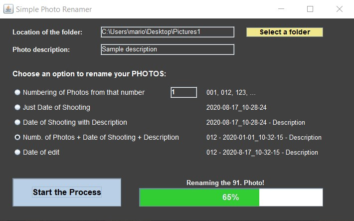
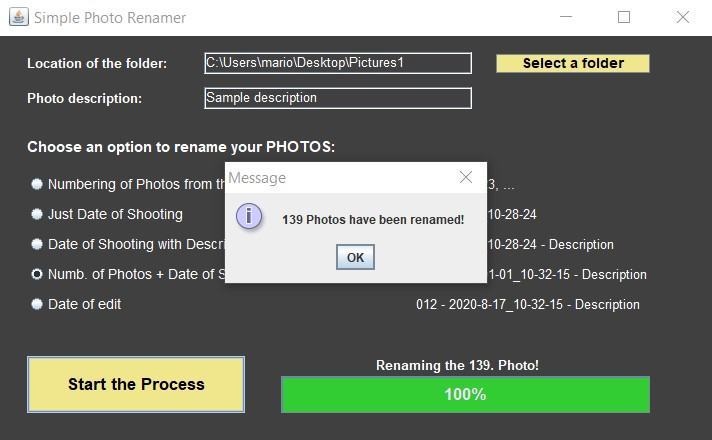
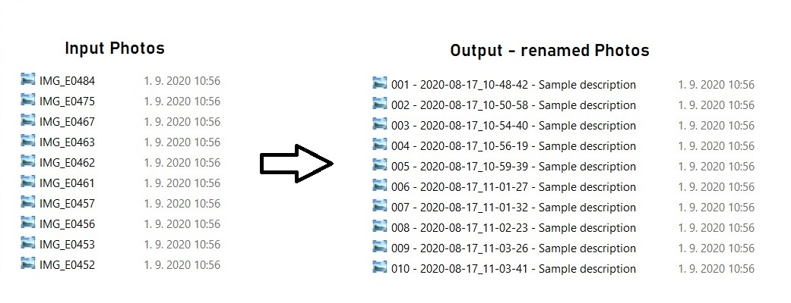

# Simple Photo Renamer Application

This is a simple desktop application for renaming **many photos** at once. 
It was developed in Java using the Eclipse IDE.

 

  

 

  

 

- In the program, I used the JavaXT libraries to determine the creation date of the Photos.
- JavaXT is an open source project released under an MIT License.

 

### How the program works
1. We start the program
2. Select the folder that contains the photos
3. Choose how we want to rename our photos
4. Press the "Start the Process" button

 

### The final result is shown in the following image

  

  
